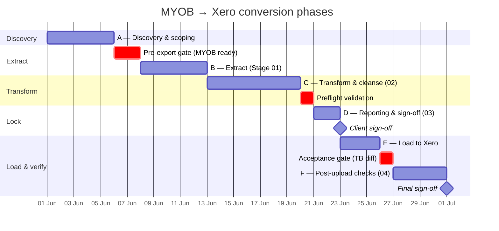
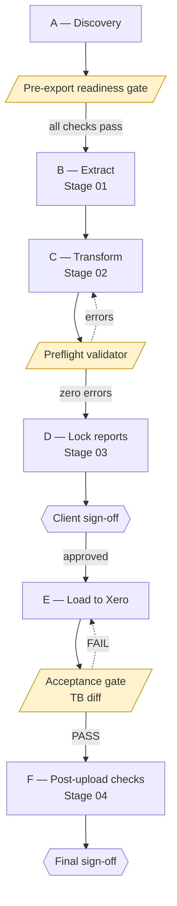
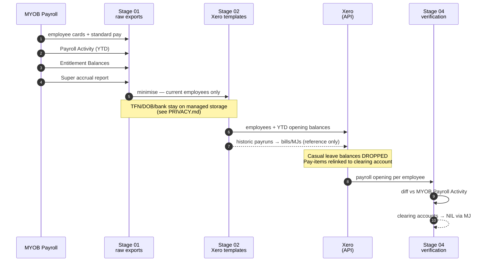

# Conversion Plan — MYOB Online → Xero

## Phases at a glance

## 0. Engagement parameters (fill in per client)

| Item | Value |
| ---- | ----- |
| Client / entity name | _TBD_ |
| ABN | _TBD_ |
| MYOB product (AccountRight Live / Essentials / Business) | _TBD_ |
| Xero plan target (Starter / Standard / Premium / Ultimate) | _TBD_ |
| Conversion date (first day reported in Xero) | _TBD_ |
| Last full month closed in MYOB | _TBD_ |
| GST registered (Y/N) and reporting cycle | _TBD_ |
| Payroll in scope (Y/N), STP phase | _TBD_ |
| Inventory tracked (Y/N) | _TBD_ |
| Multi-currency (Y/N) | _TBD_ |
| Number of bank/credit-card accounts | _TBD_ |
| Number of active jobs/tracking categories | _TBD_ |
| Target Xero org: new or existing | _new / existing_ |
| Monthly comparatives required (Y/N, range) | _TBD_ |
| Custom CoA required (Y/N) | _TBD_ |

## 1. Migration phases

### Phase A — Discovery & scoping
- Confirm subscription/plan in both MYOB and Xero.
- Document the chart-of-account structure and any custom reports.
- Confirm conversion date and whether historical years are required as
  read-only data or as opening balances only.
- Build the contact, employee, and account inventory in `INDEX.md`.

### Phase B — Extract (→ `01_exports_from_myob/`)
- **Pre-export gate**: complete every item in
  `templates/checklists/myob_file_readiness.md` first. Sign-off must be
  in `INDEX.md` change log before any data leaves MYOB.
- Pull every export listed in §2 below.
- Keep all files in **MYOB's native export format** (CSV/XLSX/PDF) without
  any cleansing.
- Each subfolder under `01_*` has its own README listing the exact menu
  path in MYOB and the columns required.

### Phase C — Transform & cleanse (→ `02_cleansed_for_xero/`)
- Re-map MYOB account codes to a Xero-friendly chart.
- Strip MYOB-specific fields (Card IDs, Job numbers) and replace with the
  Xero equivalents (Contact, Tracking Category).
- Convert tax codes (e.g. `GST`, `FRE`, `N-T`) to Xero tax rates
  (`GST on Income`, `GST Free Income`, `BAS Excluded`, etc.).
- Validate every CSV against the Xero template column order — Xero
  rejects files where headers don't match exactly.

### Phase D — Reporting & sign-off (→ `03_finalized_reports/`)
- Lock the conversion-date Balance Sheet, P&L year-to-date, Trial
  Balance, Aged Receivables, Aged Payables, GST report, and Payroll
  Activity from MYOB. These become the "source of truth" the Xero file
  must match.
- Client signs off on these reports before any upload to Xero.

### Phase E — Load & verify (→ `04_xero_post_upload_checks/`)
- Upload in the correct sequence (see §3).
- After each upload run an account-by-account reconciliation; record
  variances in the exception log.
- Track every clearing / suspense account in
  `04_xero_post_upload_checks/03_balance_reconciliations/clearing_accounts_tracker.csv`.
  None may remain non-zero at sign-off (see §6).
- Run the automated acceptance gate
  (`templates/scripts/post_upload_acceptance_check.py`) — it must
  return PASS before sign-off.
- Final sign-off via the rolled-up `06_final_sign_off/action_checklist_template.md`
  delivered to the client.

## 2. Export map (what to pull out of MYOB)

| # | Entity | MYOB source | Output folder | Xero counterpart |
| - | ------ | ----------- | -------------- | ----------------- |
| 0 | Company file metadata, users, lock dates | File ▸ Company info, Setup ▸ Preferences | `00_company_file_info/` | Organisation settings |
| 1 | Chart of accounts | Accounts ▸ Accounts List ▸ Export | `01_chart_of_accounts/` | Accounting ▸ Chart of accounts |
| 2 | Customer cards | Contacts ▸ Customers ▸ Export | `02_contacts_customers/` | Contacts (customers) |
| 3 | Supplier cards | Contacts ▸ Suppliers ▸ Export | `03_contacts_suppliers/` | Contacts (suppliers) |
| 4 | Employee cards + standard pay | Payroll ▸ Employees ▸ Export | `04_employees/` | Payroll employees |
| 5 | Inventory items, on-hand qty, avg cost | Inventory ▸ Items List ▸ Export | `05_inventory_items/` | Products & services |
| 6 | Open invoices / Aged Receivables detail | Sales ▸ Sales Register ▸ Open invoices | `06_open_invoices_AR/` | Sales invoices |
| 7 | Open bills / Aged Payables detail | Purchases ▸ Purchases Register ▸ Open bills | `07_open_bills_AP/` | Purchase bills |
| 8 | Bank & credit-card accounts + statements | Banking ▸ Bank Register, plus bank portal CSV/OFX | `08_bank_accounts_statements/` | Bank accounts + statement imports |
| 9 | General ledger detail (conversion FY) | Reports ▸ Accounts ▸ General Ledger detail | `09_general_ledger/` | Reports / manual journal reference |
| 10 | Trial Balance at conversion date | Reports ▸ Accounts ▸ Trial Balance | `10_trial_balance/` | Conversion balances |
| 11 | GST / BAS history & tax codes | Reports ▸ GST/Tax codes list | `11_tax_GST_BAS/` | Tax rates + BAS report |
| 12 | Payroll history, leave balances, super | Payroll ▸ Reports ▸ Payroll Activity / Entitlement | `12_payroll_history/` | Payroll opening balances + leave |
| 13 | Fixed asset register & depreciation | Assets module / spreadsheet | `13_fixed_assets/` | Fixed assets module |
| 14 | Jobs / categories | Lists ▸ Jobs | `14_jobs_tracking/` | Tracking categories |
| 15 | Recurring transactions | Setup ▸ Recurring transactions | `15_recurring_transactions/` | Repeating invoices/bills |
| 16 | Attachments (source docs, contracts) | In Tray, attachments | `16_attachments_documents/` | Files in Xero / attached to txn |

## 3. Recommended Xero upload order

Xero validates dependencies between data sets, so order matters:

1. Organisation settings, financial year, lock date.
2. Chart of accounts.
3. Tax rates / tracking categories.
4. Contacts (customers, then suppliers).
5. Inventory items.
6. Employees (if payroll).
7. Conversion balances (from Trial Balance).
8. Open AR invoices.
9. Open AP bills.
10. Bank statement imports for reconciliation window.
11. Payroll opening balances, leave, super.
12. Fixed assets register.
13. Repeating transactions and templates.

## 3a. Payroll data flow

## 4. Known Xero limitations to brief the client on

Some MYOB constructs do not survive the conversion intact. Set client
expectations **before** starting Phase B.

### Payroll
- Xero's API does not accept historical payruns. Each historic payrun
  is loaded as a **paid bill or manual journal** for reference only —
  it does not appear in Payroll History.
- Employees are seeded with **YTD opening balances** as of the
  conversion date. The first Xero pay run continues from there.
- **Casual employees' leave entitlement balances are not migrated** —
  set them manually in Xero before the first pay run if required.
- Pay items linked in MYOB to a bank or asset account are remapped to
  a **payroll clearing account** that must be unlinked before the
  first Xero pay run.
- Employer expenses other than superannuation do not come across in
  opening balances.

### Clearing & suspense accounts
- A **Suspense** account holds any transaction whose mapping is
  uncertain. It must be at zero before sign-off.
- A **Payroll clearing** account is created automatically for the
  pay-item issue above.
- All clearing accounts are tracked in
  `04_xero_post_upload_checks/03_balance_reconciliations/clearing_accounts_tracker.csv`.

### Other
- Recurring transaction schedules do not migrate — recreate in Xero.
- Custom MYOB reports have no Xero equivalent — replace with Xero
  report packs.
- MYOB In Tray attachments don't migrate automatically — re-attach in
  Xero Files / Hubdoc only those the client nominates.
- Closed-period detail beyond the conversion FY remains in the locked
  Stage-03 PDFs, not in Xero.

## 5. Optional: monthly comparative balances

For clients who want historic month-by-month reporting in Xero rather
than referring back to the locked Stage-03 PDFs, load per-month
opening balances into
`02_cleansed_for_xero/05_conversion_balances/monthly_comparatives/`.
Xero accepts this via the same conversion-balances screen and will
render comparative reports for the loaded range. See the folder
README for file layout and validation rules.

## 6. Privacy & payroll data handling

Payroll exports (entities 4 and 12) carry TFNs, DOBs, bank details,
and identified earnings. Treat them as the highest-risk dataset in
this migration.

- **Read `PRIVACY.md` before pulling employee or payroll data.** Do
  not begin Stage 01 for those entities until the §8 pre-pull
  sign-off checklist is fully ticked.
- Only authorised migration team members (named in `INDEX.md`) may
  open these folders. Restrict storage permissions accordingly.
- Transfer only over encrypted channels (HTTPS direct download from
  MYOB, secure portals, encrypted expiring links). **Never** by
  plain email or personal cloud drive.
- Minimise data at Stage 02: current employees only, drop notes and
  history Xero doesn't need (see Stage-02 payroll READMEs).
- Validator logs must not echo TFN, DOB, or bank values.
- Secure-delete payroll exports within 30 days of final sign-off and
  record the destruction (`04_xero_post_upload_checks/06_final_sign_off/`).
- A misdirected file is a notifiable breach candidate — follow
  `PRIVACY.md` §7 immediately, do not attempt to "fix by forwarding".

## 7. Tolerances & sign-off

- Variances ≤ A$1.00 per account are recorded but accepted.
- Variances > A$1.00 must be investigated and either corrected or
  documented in `04_xero_post_upload_checks/05_exception_log/`.
- Final sign-off requires:
  - Trial Balance match (within tolerance) on conversion date.
  - Aged Receivables / Payables totals match per contact.
  - Bank account balances match the cleared balance on the statement.
  - GST control accounts match the most recent lodged BAS.
