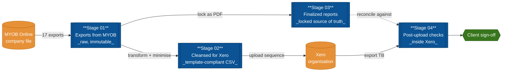

# MYOB Online → Xero Migration Toolkit

A structured, repeatable project framework for converting a client's MYOB
Online (AccountRight Live / Essentials / Business) company file into a Xero
organisation file.

The toolkit enforces a four-stage pipeline:



| Stage | Folder | Purpose |
| ----- | ------ | ------- |
| 1 | `01_exports_from_myob/` | Receive every raw export pulled out of MYOB, kept in original format. |
| 2 | `02_cleansed_for_xero/` | Transform raw exports into Xero-approved CSV/XLSX templates. |
| 3 | `03_finalized_reports/` | Snapshot of pre-conversion balances, reconciliations, sign-offs. |
| 4 | `04_xero_post_upload_checks/` | Account-by-account verification inside Xero after upload. |

See `PLAN.md` for the full conversion plan and export mapping, and
`INDEX.md` for the live status of every artefact.

## CLI quick reference

The `migration.py` wrapper at the toolkit root provides a single entry
point for the most common operations:

```bash
python migration.py status                                   # progress dashboard
python migration.py init --client "Acme Pty Ltd" \
    --conversion-date 2026-07-01 --xero-org-target new \
    --lead "J. Smith" [--dry-run]                            # fill engagement params
python migration.py validate <cleansed.csv> <template.csv>   # Stage-02 preflight
python migration.py check --myob <myob_tb.csv> --xero <xero_tb.csv>  # Stage-04 gate
```

`status` reads `INDEX.md` and the Stage-04 trackers; it prints a
coloured per-stage progress bar, the open-exception count, the
clearing-account roll-up, and the acceptance-gate verdict.

> ⚠️ **Before you pull any employee or payroll data, read `PRIVACY.md`.**
> Payroll exports contain TFNs and identified earnings — they are
> governed by the Privacy Act 1988, the TFN Rule 2015, and the
> Notifiable Data Breaches scheme. Real client files must never be
> committed to this repository; see `.gitignore`.

## Quick start

1. Read `PLAN.md` end-to-end before pulling any data — especially
   §4 (known Xero limitations: payroll, clearing accounts,
   recurring txns, attachments) so the client is briefed up front.
2. Fill in client details in `INDEX.md` (company name, conversion date,
   GST status, payroll cut-over, target Xero org new-or-existing,
   monthly comparatives, custom CoA).
3. **Pre-export gate**: complete `templates/checklists/myob_file_readiness.md`
   inside MYOB. Do not start Stage 01 until every item is ticked or
   exception-logged.
4. Work top-down through the four folders — do not skip stages.
5. Update the status column in `INDEX.md` whenever an artefact moves
   between stages.
6. At Stage 04, run `templates/scripts/post_upload_acceptance_check.py`
   as the automated TB-diff gate, then deliver
   `04_xero_post_upload_checks/06_final_sign_off/action_checklist_template.md`
   to the client as the single roll-up summary.

## Conventions

- File naming: `<entity>_<scope>_<YYYYMMDD>.<ext>`
  e.g. `chart_of_accounts_full_20260605.csv`
- Every folder contains its own `README.md` describing required inputs,
  expected outputs, and the Xero template (where relevant).
- Nothing leaves a stage until its checklist in `INDEX.md` is ticked.
- Raw exports in `01_*` are immutable — never edit them in place; copy
  forward into `02_*` and transform there.
