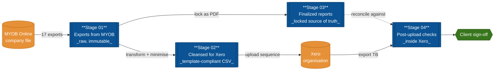

# MYOB Online → Xero Migration Toolkit

A structured, repeatable project framework for converting a client's MYOB
Online (AccountRight Live / Essentials / Business) company file into a Xero
organisation file.

The toolkit enforces a four-stage pipeline:



| Stage | Folder | Purpose |
| ----- | ------ | ------- |
| 1 | `01_exports_from_myob/` | Receive every raw export pulled out of MYOB, kept in original format. |
| 2 | `02_cleansed_for_xero/` | Transform raw exports into Xero-approved CSV/XLSX templates. |
| 3 | `03_finalized_reports/` | Snapshot of pre-conversion balances, reconciliations, sign-offs. |
| 4 | `04_xero_post_upload_checks/` | Account-by-account verification inside Xero after upload. |

**New here?** Start with **`GETTING_STARTED.md`** — a step-by-step
walk-through of your first migration with the exact commands to run
at each phase.

See `PLAN.md` for the full conversion plan and export mapping, and
`INDEX.md` for the live status of every artefact.

## For non-technical users — double-click and go

If you don't use a terminal, **double-click one of these launchers**
to open the interactive dashboard in your browser. The first run
sets up Python deps automatically (~30s); subsequent launches are
near-instant.

| Platform | File |
| -------- | ---- |
| macOS | `Start Migration Dashboard.command` |
| Windows | `Start Migration Dashboard.bat` |
| Linux | `start_dashboard.sh` |

From the dashboard you can create a new engagement, tick artefacts
done, drag-and-drop files into stage folders, validate Stage-02 CSVs,
run the trial-balance acceptance gate, log exceptions, and download
all three PDF deliverables — without touching the terminal or a
markdown file.

## Visual layer (for power users)

Same data, multiple surfaces:

| Surface | Command | Audience | Dependencies |
| ------- | ------- | -------- | ------------ |
| Terminal | `python migration.py status` | day-to-day operator | none |
| Browser | `streamlit run dashboard.py` | accountant, partner | `pip install -r requirements.txt` |
| Printable PDF (status) | `python migration.py report -o status.pdf` | client / file | `reportlab` |
| **Visual onboarding guide** | `python migration.py guide -o guide.pdf` | new team member | `reportlab` |
| **Hosted status page** | `python migration.py site -o _site/ --include-pdfs` | client / partner firm (URL-share) | none — static HTML |
| CI artefact | GitHub Actions `Migration status` workflow | reviewers | runs in CI |

### CLI

```bash
python migration.py status                                          # coloured progress dashboard
python migration.py init --client "Acme Pty Ltd" \
    --conversion-date 2026-07-01 --xero-org-target new \
    --lead "J. Smith" [--dry-run]                                   # fill engagement params
python migration.py validate <cleansed.csv> <template.csv>          # Stage-02 preflight
python migration.py check --myob <myob_tb.csv> --xero <xero_tb.csv> # Stage-04 acceptance gate
python migration.py report --output status_report.pdf               # one-page PDF
```

### Streamlit dashboard

```bash
pip install -r requirements.txt
streamlit run dashboard.py
```

Open `http://localhost:8501`. The dashboard renders:

- **Overview** — client header, four per-stage progress bars, roll-up
  metrics (open exceptions, clearing accounts at NIL, acceptance-gate
  verdict), and the Equity vs Net-Profit reconciliation.
- **Per-stage pages** — Stage 01 / 02 / 03 / 04 each show their
  artefact table with done / wip / exception counts.
- **Exceptions** — filterable table of `exceptions.csv`.
- **Action Checklist** — preview of the client-facing sign-off
  document.

The dashboard is read-only — nothing it does modifies the underlying
files. **Run it locally only when real client data is loaded**
(see `PRIVACY.md`).

### GitHub Actions

`.github/workflows/migration-status.yml` runs `migration.py status`
on every push that touches the toolkit, publishes the text output to
the workflow summary, generates the PDF, and uploads both as a
30-day artefact.

### Hosted status page (GitHub Pages)

The toolkit also publishes a self-contained static HTML status page
that anyone with the URL can view in a browser — no Python install,
no terminal, no login. Useful for sharing live progress with the
client or partner firm.

- **Locally**: `python migration.py site -o _site/ --include-pdfs`,
  then open `_site/index.html` in your browser.
- **Auto-hosted on every push**: the
  `.github/workflows/publish-site.yml` workflow rebuilds the site on
  every push to `main` and publishes to
  `https://<owner>.github.io/<repo>/`. To enable it once: in the
  repo's **Settings → Pages**, change *Source* to **GitHub Actions**;
  the first successful workflow run prints the URL.

The page surfaces only counts and labels — never raw CSVs, balances,
or employee data. The four deliverable PDFs (`migration_plan`,
`action_checklist`, `post_conversion_checklist`,
`getting_started_visual`) are linked from the page when
`--include-pdfs` is passed.

> ⚠️ **Before you pull any employee or payroll data, read `PRIVACY.md`.**
> Payroll exports contain TFNs and identified earnings — they are
> governed by the Privacy Act 1988, the TFN Rule 2015, and the
> Notifiable Data Breaches scheme. Real client files must never be
> committed to this repository; see `.gitignore`.

## Quick start

1. Read `PLAN.md` end-to-end before pulling any data — especially
   §4 (known Xero limitations: payroll, clearing accounts,
   recurring txns, attachments) so the client is briefed up front.
2. Fill in client details in `INDEX.md` (company name, conversion date,
   GST status, payroll cut-over, target Xero org new-or-existing,
   monthly comparatives, custom CoA).
3. **Pre-export gate**: complete `templates/checklists/myob_file_readiness.md`
   inside MYOB. Do not start Stage 01 until every item is ticked or
   exception-logged.
4. Work top-down through the four folders — do not skip stages.
5. Update the status column in `INDEX.md` whenever an artefact moves
   between stages.
6. At Stage 04, run `templates/scripts/post_upload_acceptance_check.py`
   as the automated TB-diff gate, then deliver
   `04_xero_post_upload_checks/06_final_sign_off/action_checklist_template.md`
   to the client as the single roll-up summary.

## Conventions

- File naming: `<entity>_<scope>_<YYYYMMDD>.<ext>`
  e.g. `chart_of_accounts_full_20260605.csv`
- Every folder contains its own `README.md` describing required inputs,
  expected outputs, and the Xero template (where relevant).
- Nothing leaves a stage until its checklist in `INDEX.md` is ticked.
- Raw exports in `01_*` are immutable — never edit them in place; copy
  forward into `02_*` and transform there.
